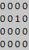
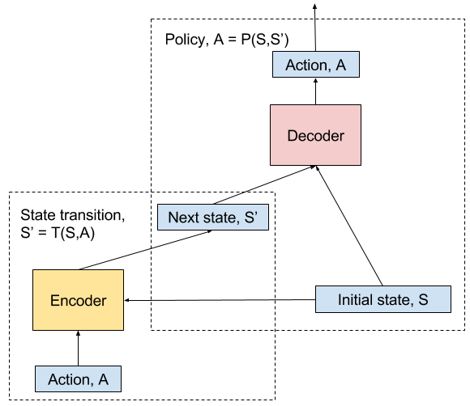

# policy-autoencoder

This is a simple policy auto-encoder model that learns approximation of state transition and policy functions. These functions are deterministic versions of the corresponding MDP probability distributions. The state transition can be used in model based reinforcement learning for planning complex behaviors. The policy function provides elementary actions from the current state to the next desired state. An agent just "imagines" a next state it wants to be in and apply this function to get there. 
 
The test environment is a grid world consisting of an dot agent with 9 actions: up, up-right, right, down-right, down,  down-left, left, up-left, and stop. The training data set is randomly generated initial states, actions and next states, e.g. a sample for 4x4 gird-world: 

Initial state|Action|Next state 
:---:|:---:|:---:
|Move right|

The model consists of two modules: 
- Encoder that accepts initial state and action and outputs a next state; 
- Decoder that takes initial state, next state and outputs an action.

The trained model can be decoupled in to: 
- Encoder module used for prediction of next state - state transition function; 
- Decoder module  used to provide elementary actions to achieve desired state - policy function. 
